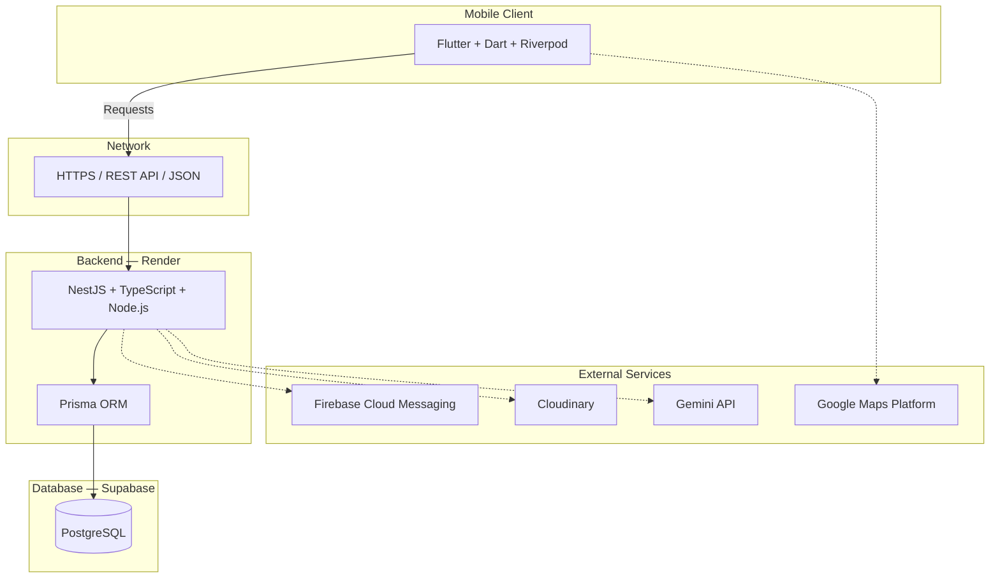

# 💈 Salon WOW: Smart Salon Appointment & Management System

[](https://flutter.dev)
[](https://nestjs.com/)
[](https://www.postgresql.org/)
[](https://supabase.com/)
[](https://ai.google.dev/)

**Salon WOW** is a mobile-based smart salon appointment and management system built for **Salon WOW** in Pambahinna, Ratnapura, Sri Lanka. The platform integrates real-time appointment scheduling, role-based salon operations, loyalty rewards, and AI-powered hairstyle recommendations into a single unified mobile application serving both **Customer** and **Admin** experiences.

> *"Unlock your best look"*

---

## 🏗️ Architecture Overview

Salon WOW follows a clean **client-server architecture** with a Flutter mobile client communicating over REST APIs to a NestJS backend, backed by PostgreSQL on Supabase:

```text
SALON-WOW-App-Development/
├── mobile/              # Flutter application (Customer & Admin experiences)
├── backend/             # NestJS API server (TypeScript + Node.js)
├── prisma/              # Prisma schema, migrations, and seed data
└── docs/                # Project documentation and assets
```



---

## ✨ Key Capabilities

### 📱 Mobile Application — Customer

- **Authentication:** Registration, login, and OTP verification.
- **Salon Discovery:** View salon information, services, prices, and active offers.
- **Appointment Booking:** Select date, time slot, and preferred services with real-time availability.
- **Appointment Management:** View details, cancel, and reschedule appointments.
- **Appointment History:** Full archive of past visits and completed services.
- **Notifications:** Push notifications for confirmations, reminders, and promotions.
- **WOW Points:** Loyalty reward points earned per visit, redeemable on future bookings.
- **AI Hair Recommend:** Upload a photo and receive personalized hairstyle suggestions via Gemini API, linked directly to salon services and the booking flow.
- **Profile & Settings:** Manage personal details, preferences, and notification controls.

### 📱 Mobile Application — Admin

- **Dashboard:** Operational overview of daily appointments and salon metrics.
- **Appointment Lifecycle:** Accept, reject, cancel, complete, and reschedule bookings.
- **Service Management:** Add, update, price, and toggle salon service availability.
- **Offer Management:** Create and manage promotional campaigns and discount packages.
- **Schedule Configuration:** Working hours, break periods, unavailable dates, and time slot settings.
- **Stylist Management:** Stylist profiles, availability, and appointment assignments.
- **Customer Management:** Client directory, booking history, and contact records.
- **WOW Points Management:** Configure loyalty rules, adjust balances, and oversee redemptions.
- **Salon Information:** Update address, contact details, policies, and announcements.
- **Notification Management:** Broadcast alerts and targeted notifications to clients.

### 🤖 AI Hair Recommend

Customers upload a photo → Gemini API analyzes facial features and hair characteristics → returns personalized hairstyle suggestions → maps recommendations to matching Salon WOW services → seamless transition into appointment booking.

---

## 🛠️ Technology Stack

| Layer | Technologies |
| :--- | :--- |
| **Mobile Client** | Flutter, Dart, Riverpod |
| **Backend & APIs** | NestJS, TypeScript, Node.js, REST API, JSON |
| **Database** | PostgreSQL, Prisma ORM |
| **Cloud & Hosting** | Supabase (Database), Render (Backend) |
| **Auth & Security** | JWT, Refresh Tokens, Argon2id, RBAC |
| **Notifications** | Firebase Cloud Messaging |
| **Media Storage** | Cloudinary |
| **Location** | Google Maps Platform |
| **AI** | Gemini API |
| **Testing** | Flutter Test, Jest, Postman |
| **Design** | Figma |
| **CI/CD** | GitHub Actions |
| **Monitoring** | Sentry |
| **Version Control** | Git, GitHub |

---

## 🎨 Design System

| Role | Colour | HEX |
| :--- | :--- | :---: |
| **Primary** | Matte Black | `#111111` |
| **Secondary / Surface** | Ceramic Stone | `#F4F4F2` |
| **Accent** | Warm Amber Wood | `#DE9D2E` |

**Brand:** Salon WOW · **Type:** Unisex Salon · **Tagline:** *"Unlock your best look"*

---

## 🤝 Branching & Commit Guidelines

- **Branch format:** `feature/<feature-name>`, `fix/<bug-name>`, `chore/<task-name>`
- **Commit convention:** `[SALON-WOW] YYYY-MM-DD | <Type>: <Description>`

*Example:* `[SALON-WOW] 2026-09-25 | Feat: Implement customer appointment booking flow`

---

## 🚧 Project Status

🚧 **Development in Progress**

This is an **IS5109 Community Project** at **Sabaragamuwa University of Sri Lanka**.

---

## 👥 Development Team

| Student ID | Name |
| :---: | :--- |
| 22FIS0584 | S. Rishikesan |
| 22FIS0520 | M.M.F. Musfira |
| 22FIS0560 | C. Thinushanth |
| 22FIS0583 | V. Mathujan |
| 22FIS0585 | E. Mayoori |
| 22FIS0470 | R.W.A.D.L. Anuradha |

### Academic Supervisor

**Mr. K.P.D.P. Patabandi**
Lecturer, Department of Computing and Information Systems
Faculty of Computing, Sabaragamuwa University of Sri Lanka

---

## 📌 Project Information

| | |
| :--- | :--- |
| **Module** | IS5109 — Community Project |
| **Institution** | Sabaragamuwa University of Sri Lanka |
| **Faculty** | Faculty of Computing |
| **Department** | Department of Computing and Information Systems |
| **Client** | Salon WOW |
| **Location** | Pambahinna, Ratnapura, Sri Lanka |
