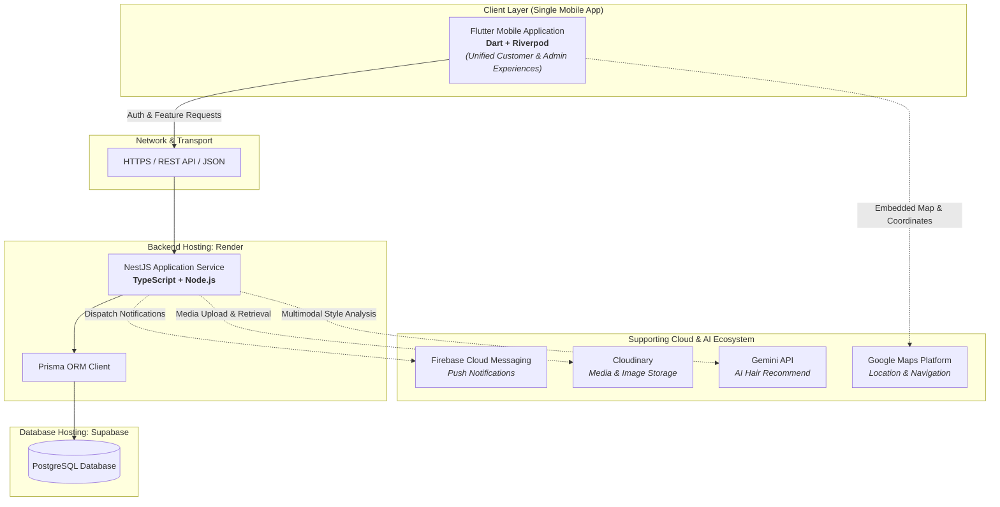

<div align="center">

# 💈 Salon WOW: Smart Salon Appointment and Management System

### *"Unlock your best look"*

[](https://github.com/Rishikesan05/SALON-WOW-App-Development)
[](https://www.sab.ac.lk/)
[](https://www.sab.ac.lk/computing/)

<br/>

[](https://flutter.dev/)
[](https://dart.dev/)
[](https://riverpod.dev/)
[](https://nestjs.com/)
[](https://www.typescriptlang.org/)
[](https://www.postgresql.org/)
[](https://www.prisma.io/)
[](https://supabase.com/)
[](https://render.com/)
[](https://ai.google.dev/)
[](https://firebase.google.com/)
[](https://cloudinary.com/)
[](https://developers.google.com/maps)

</div>

---

## 📑 Table of Contents

- [Overview](#-overview)
- [Application Experiences](#-application-experiences)
- [Key Features](#-key-features)
  - [Customer Experience](#-customer-experience)
  - [Admin Experience](#-admin-experience)
  - [AI Hair Recommend](#-ai-hair-recommend)
- [Technology Stack](#-technology-stack)
- [Architecture Overview](#-architecture-overview)
- [Design System](#-design-system)
- [Project Status](#-project-status)
- [Development Team](#-development-team)
- [Project Information](#-project-information)

---

## 📖 Overview

**Salon WOW: Smart Salon Appointment and Management System** is a mobile-based appointment scheduling and operations management platform engineered specifically for **Salon WOW** in Pambahinna, Ratnapura, Sri Lanka.

Conceived and executed as an academic community project for the **IS5109 Community Project** module at the **Sabaragamuwa University of Sri Lanka**, this solution transitions traditional walk-in and phone-based booking workflows into an intelligent, digitized ecosystem.

> [!NOTE]
> **Single Unified App Architecture:** Both **Customer** and **Admin** personas are unified within a single Flutter mobile application, eliminating the need for a separate web dashboard and granting the salon administration full operational control directly from mobile devices.

---

## 📱 Application Experiences

The mobile solution delivers two specialized, role-based workflows driven by role-based access control (RBAC):

```
┌────────────────────────────────────────────────────────┐
│            SALON WOW MOBILE APPLICATION                │
│                 (Flutter + Riverpod)                   │
├──────────────────────────┬─────────────────────────────┤
│   👤 Customer Experience │    🛠️ Admin Experience      │
│  ─────────────────────── │   ────────────────────────  │
│  • Intuitive self-booking│   • Real-time schedule grid │
│  • Live slot availability│   • Booking status actions  │
│  • AI Hairstyle advisor  │   • Service & offer control │
│  • WOW Points loyalty    │   • Staff & break rosters   │
└──────────────────────────┴─────────────────────────────┘
```

---

## ✨ Key Features

### 👤 Customer Experience

Designed for effortless discovery, convenience, and elevated client engagement:

- **Customer Registration & Login:** Simple and rapid onboarding for new and returning clients.
- **OTP Verification:** One-time password verification safeguarding authentication and bookings.
- **View Salon Information:** Explore salon profiles, facilities, working hours, and contact details.
- **View Services & Prices:** Transparent service catalogs with categorized pricing, durations, and descriptions.
- **View Offers:** Access seasonal campaigns, exclusive packages, and promotional pricing.
- **Make Appointments:** Seamless multi-service booking workflows with customized preferences.
- **Select Date & Time:** Interactive date picker with dynamically calculated real-time available time slots.
- **View Appointment Details:** Comprehensive breakdown of upcoming appointments and instructions.
- **Cancel Appointments:** Client-driven appointment cancellation within designated salon policy periods.
- **Reschedule Appointments:** Intuitive slot-shifting when personal schedules change.
- **Appointment History:** Detailed archive of past visits, chosen styles, and receipts.
- **Notifications:** Timely push notifications for confirmations, upcoming reminders, and updates.
- **WOW Points:** Automated loyalty rewards program to accumulate points and redeem on future visits.
- **Profile Management:** Manage personal preferences, contact numbers, and avatars.
- **Settings:** Tailor notification preferences and application configurations.
- **AI Hair Recommend:** Multimodal generative AI styling assistance.

---

### 🛠️ Admin Experience

A full-fledged mobile management suite enabling salon owners and managers to govern day-to-day operations:

- **Admin Login:** Secure role-based gateway providing elevated managerial rights.
- **Dashboard:** High-level executive overview of daily bookings, revenue indicators, and customer trends.
- **Appointment Management:** Centralized hub for tracking all incoming, confirmed, and ongoing appointments.
- **Accept, Reject, Cancel & Complete Appointments:** Full lifecycle status controls with real-time customer updates.
- **Reschedule Appointments:** Dynamic reallocation of appointment slots to balance stylist loads.
- **Service Management:** Add, modify, categorize, price, and toggle availability of salon services.
- **Offer Management:** Launch, adjust, and retire marketing campaigns and special discount packages.
- **Working Hours Management:** Configure business start and end times for regular weekdays and weekends.
- **Break Management:** Schedule lunch hours, technical pauses, and operational intervals without booking conflicts.
- **Unavailable Date Management:** Set blackout periods for national holidays, staff retreats, and emergency closures.
- **Time Slot Management:** Tune slot duration increments, concurrency limits, and booking buffers.
- **Stylist Management:** Maintain stylist records, availability statuses, specialties, and assigned appointments.
- **Customer Management:** Directory of salon clients, engagement histories, and visit records.
- **WOW Points Management:** Configure loyalty conversion rules, adjust point balances, and oversee redemptions.
- **Salon Information Management:** Update addresses, phone numbers, policy notes, and general announcements.
- **Notification Management:** Broadcast important updates, announcements, and direct alerts to registered clients.

---

### 🤖 AI Hair Recommend

The **AI Hair Recommend** engine integrates Google's **Gemini API** directly into the customer styling journey:

```
[ Customer Selfie / Photo ]
            │
            ▼
[ Gemini Multimodal API Analysis ] ──> (Evaluates facial geometry, hair texture & density)
            │
            ▼
[ Tailored Style Recommendations ] ──> (Visual inspiration & cut/treatment suggestions)
            │
            ▼
[ Direct Salon Service Link ]      ──> (Maps suggestion to matching Salon WOW service)
            │
            ▼
[ Instant Appointment Booking ]    ──> (Select date, time, and confirmed appointment)
```

1. **Photo Upload:** Customers take or upload a front-facing portrait photo in the mobile app.
2. **Generative Style Recommendation:** The Gemini API analyzes facial proportions, hair characteristics, and current styling trends to suggest flattering, modern hairstyles.
3. **End-to-End Booking Connection:** Each recommended hairstyle is seamlessly paired with the corresponding Salon WOW service, allowing the client to book an appointment for that exact style in a single flow.

---

## 🛠️ Technology Stack

| Area | Technology | Purpose & Architectural Justification |
|---|---|---|
| **Mobile Application** | Flutter, Dart | High-performance, cross-platform mobile framework delivering native 60fps UX |
| **State Management** | Riverpod | Compile-safe, declarative, and easily testable reactive state management |
| **Backend** | NestJS, TypeScript, Node.js | Scalable, modular enterprise-grade architecture with strict dependency injection |
| **API** | REST API, JSON | Predictable, well-documented HTTP contract for mobile-backend synchronization |
| **Database** | PostgreSQL | Enterprise-grade relational database guaranteeing transactional ACID integrity |
| **ORM** | Prisma | Type-safe database access layer, intuitive migrations, and automated query builder |
| **Database Hosting** | Supabase | Managed cloud PostgreSQL instance with automated backups and security |
| **Backend Hosting** | Render | Automated CI/CD deployment platform for cloud container execution |
| **Authentication** | JWT, Refresh Tokens | Stateless token pairs ensuring seamless session continuity and strict revocation |
| **Password Security** | Argon2id | Modern, memory-hard hashing algorithm resistant to GPU-accelerated attacks |
| **Authorization** | RBAC | Role-Based Access Control enforcing strict Customer and Admin boundary checks |
| **Notifications** | Firebase Cloud Messaging (FCM) | Low-latency, reliable background and foreground push notification delivery |
| **Image Storage** | Cloudinary | CDN-backed cloud media storage with on-the-fly image optimization |
| **Maps** | Google Maps Platform | Accurate salon geolocation rendering, directions, and customer distance queries |
| **AI** | Gemini API | Multimodal generative vision capabilities powering personalized hairstyle suggestions |
| **Testing** | Flutter Test, Jest, Postman | Multi-tier validation spanning unit tests, backend controllers, and integration contracts |
| **Version Control** | Git, GitHub | Distributed version control with pull request reviews and Git branch governance |
| **Design** | Figma | Interactive wireframing, high-fidelity prototypes, and component design tokens |
| **CI/CD** | GitHub Actions | Automated build checks, test runners, and continuous delivery workflows |
| **Monitoring** | Sentry | Real-time crash diagnostics, unhandled exception tracking, and performance metrics |

---

## 🏗️ Architecture Overview

The diagram below represents the system architecture, illustrating the end-to-end data flow from the single mobile application through the API layer to the backend services, relational database, and supporting cloud integrations:



---

## 🎨 Design System

**Brand:** Salon WOW  
**Tagline:** *"Unlock your best look"*  
**Salon Type:** Unisex Salon  

The design system is constructed around an elegant, gender-neutral aesthetic that combines modern minimalism with warm salon craftsmanship.

### Colour Palette

| Role | Colour | HEX | Intended Application |
|---|---|:---:|---|
| **Primary** | **Matte Black** | `#111111` | Primary brand identity, dark headers, high-contrast typography, deep navigation elements, and framing to establish a sleek, premium foundation. |
| **Secondary / Surface** | **Ceramic Stone** | `#F4F4F2` | Clean background canvas, surface cards, soft module borders, and neutral contrast zones ensuring maximum readability and visual softness. |
| **Tertiary / Accent** | **Warm Amber Wood** | `#DE9D2E` | High-impact call-to-actions, booking buttons, status highlights, badge markers, and WOW Points indicators—evoking natural timber and salon luxury. |

---

## 🚧 Project Status

```
Status: 🚧 Development in Progress
Phase : Initial System Architecture & Foundation
```

This project is actively maintained and developed under the academic curriculum of **IS5109 - Community Project** at the **Sabaragamuwa University of Sri Lanka**.

---

## 👥 Development Team

| Student ID | Name |
|:---:|---|
| **22FIS0584** | S. Rishikesan |
| **22FIS0520** | M.M.F. Musfira |
| **22FIS0560** | C. Thinushanth |
| **22FIS0583** | V. Mathujan |
| **22FIS0585** | E. Mayoori |
| **22FIS0470** | R.W.A.D.L. Anuradha |

### Academic Supervisor

**Mr. K.P.D.P. Patabandi**  
Lecturer  
Department of Computing and Information Systems  
Faculty of Computing  
Sabaragamuwa University of Sri Lanka  

---

## 📌 Project Information

- **Module:** IS5109 - Community Project
- **Institution:** Sabaragamuwa University of Sri Lanka
- **Faculty:** Faculty of Computing
- **Department:** Department of Computing and Information Systems
- **Client / Stakeholder:** Salon WOW
- **Location:** Pambahinna, Ratnapura, Sri Lanka
- **Repository:** [Rishikesan05/SALON-WOW-App-Development](https://github.com/Rishikesan05/SALON-WOW-App-Development)
