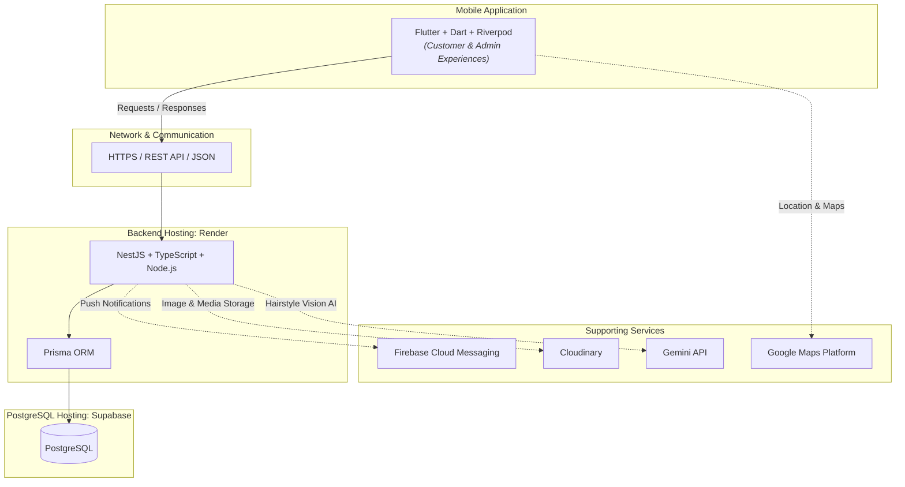

# Salon WOW: Smart Salon Appointment and Management System

> *"Unlock your best look"*

---

## 📖 Introduction

**Salon WOW: Smart Salon Appointment and Management System** is a mobile-based Smart Salon Appointment and Management System developed as a university community project for **Salon WOW** in Pambahinna, Ratnapura, Sri Lanka.

The system is designed to improve salon appointment booking and management activities through a modern, digital solution. The application delivers two role-based experiences within one single mobile application:

- **Customer:** Intuitive self-service appointment scheduling, service discovery, loyalty rewards tracking, and AI-powered hairstyle recommendations.
- **Admin:** Comprehensive salon management including appointments, service offerings, business hours, staff, and customer management directly on the mobile app.

---

## ✨ Key Features

### 👤 Customer

- **Customer Registration & Login:** Quick account creation and secure authentication.
- **OTP Verification:** Verification code authentication for enhanced account security.
- **View Salon Information:** Access salon details, location, contact information, and operating hours.
- **View Services and Prices:** Browse comprehensive salon service offerings with transparent pricing.
- **View Offers:** Discover seasonal discounts, special promotions, and package deals.
- **Make Appointments:** Conveniently book appointments online with preferred services.
- **Select Date and Time:** Real-time calendar and available time slot selection.
- **View Appointment Details:** Instant access to upcoming booking summaries and information.
- **Cancel Appointments:** Self-service cancellation within permissible salon policy windows.
- **Reschedule Appointments:** Seamlessly modify booking dates and time slots when plans change.
- **Appointment History:** Review past appointments, completed services, and visit records.
- **Notifications:** Real-time push updates for booking confirmations, reminders, and offers.
- **WOW Points:** Loyalty reward points earned through visits and redeemable on bookings.
- **Profile Management:** Update personal contact details and account settings.
- **Settings:** App preferences and notification controls.
- **AI Hair Recommend:** Personalized hairstyle suggestions powered by multimodal AI.

### 🛠️ Admin

- **Admin Login:** Secure role-based administrative access.
- **Dashboard:** At-a-glance operational overview of salon metrics and daily appointments.
- **Appointment Management:** Comprehensive control over all salon reservations.
- **Accept, Reject, Cancel, and Complete Appointments:** Status lifecycle management for bookings.
- **Reschedule Appointments:** Reallocate appointment times or slots to balance salon traffic.
- **Service Management:** Add, update, price, and organize salon services catalog.
- **Offer Management:** Create, update, and manage seasonal promotional packages and discounts.
- **Working Hours Management:** Configure regular operating schedules and business hours.
- **Break Management:** Schedule staff and salon break times during working hours.
- **Unavailable Date Management:** Mark holidays, off-days, and special closure dates.
- **Time Slot Management:** Control slot durations, capacities, and booking availability.
- **Stylist Management:** Manage stylist profiles, rosters, and assignments.
- **Customer Management:** View client profiles, booking history, and contact details.
- **WOW Points Management:** Administer loyalty point allocations and redemption configurations.
- **Salon Information Management:** Update salon details, address, guidelines, and contact numbers.
- **Notification Management:** Broadcast announcements and manage alert notifications.

### 🤖 AI Hair Recommend

Customers can upload a suitable photo and receive personalized hairstyle recommendations using the **Gemini API**. The recommendation can be directly connected to a relevant salon service and booking process, allowing customers to transition smoothly from recommendation to appointment scheduling.

---

## 🛠️ Technology Stack

| Area | Technology |
|---|---|
| Mobile Application | Flutter, Dart |
| State Management | Riverpod |
| Backend | NestJS, TypeScript, Node.js |
| API | REST API, JSON |
| Database | PostgreSQL |
| ORM | Prisma |
| Database Hosting | Supabase |
| Backend Hosting | Render |
| Authentication | JWT, Refresh Tokens |
| Password Security | Argon2id |
| Authorization | RBAC |
| Notifications | Firebase Cloud Messaging |
| Image Storage | Cloudinary |
| Maps | Google Maps Platform |
| AI | Gemini API |
| Testing | Flutter Test, Jest, Postman |
| Version Control | Git, GitHub |
| Design | Figma |
| CI/CD | GitHub Actions |
| Monitoring | Sentry |

---

## 🏗️ Architecture Overview

---

## 🎨 Design System

**Brand:** Salon WOW  
**Tagline:** *"Unlock your best look"*  
**Salon Type:** Unisex Salon  

### Colour Palette

| Role | Colour | HEX |
|---|---|---|
| Primary | Matte Black | `#111111` |
| Secondary / Surface | Ceramic Stone | `#F4F4F2` |
| Tertiary / Accent | Warm Amber Wood | `#DE9D2E` |

#### Colour Application:
- **Matte Black (`#111111`):** Serves as the primary brand colour, providing deep contrast, modern elegance, and clean typography.
- **Ceramic Stone (`#F4F4F2`):** Functions as the secondary and surface colour, delivering light, soft backgrounds and high-readability card surfaces.
- **Warm Amber Wood (`#DE9D2E`):** Acts as the accent colour for call-to-action buttons, key highlights, badges, and WOW Points, adding warm energy inspired by salon craft.

---

## 🚧 Project Status

🚧 **Development in Progress**

This is an **IS5109 Community Project** at **Sabaragamuwa University of Sri Lanka**.

---

## 👥 Development Team

| Student ID | Name |
|---|---|
| 22FIS0584 | S. Rishikesan |
| 22FIS0520 | M.M.F. Musfira |
| 22FIS0560 | C. Thinushanth |
| 22FIS0583 | V. Mathujan |
| 22FIS0585 | E. Mayoori |
| 22FIS0470 | R.W.A.D.L. Anuradha |

### Academic Supervisor

**Mr. K.P.D.P. Patabandi**  
Lecturer  
Department of Computing and Information Systems  
Faculty of Computing  
Sabaragamuwa University of Sri Lanka  

---

## 📌 Project Information

- **Module:** IS5109 - Community Project
- **Institution:** Sabaragamuwa University of Sri Lanka
- **Faculty:** Faculty of Computing
- **Department:** Department of Computing and Information Systems
- **Client / Stakeholder:** Salon WOW
- **Location:** Pambahinna, Ratnapura, Sri Lanka
